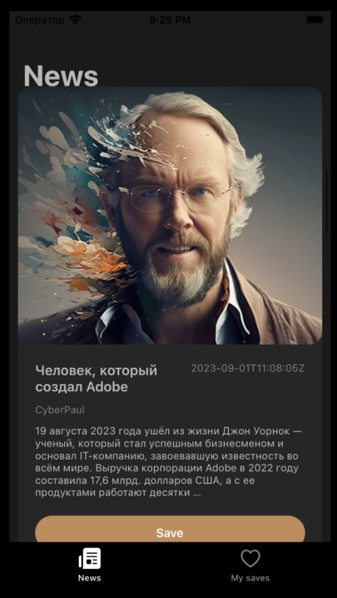
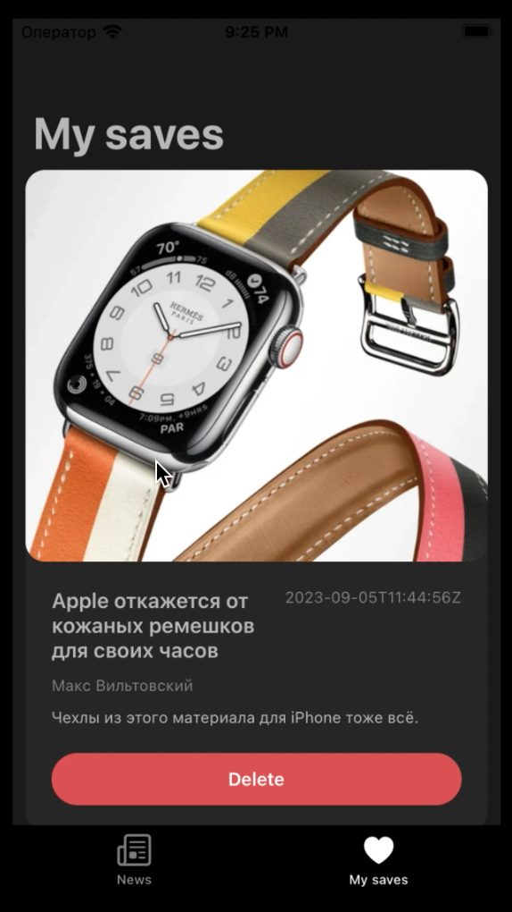

# Проект "MyNews"

Проект "MyNews" создан для изучения работы с `Realm`, сетевых запросов через `URLSession` и `Alamofire`, а также для работы с загрузкой изображений с использованием библиотеки `sdWebImage` в iOS-приложениях. Приложение представляет собой новостное приложение с двумя экранами: "News" и "My Saves".

## Описание проекта

Цель проекта - овладение основами работы с хранением данных в `Realm`, сетевых запросов и загрузки изображений в iOS-приложениях. На экране "News" отображаются новости, полученные через API. Пользователи могут сохранять понравившиеся новости, которые отображаются на экране "My Saves".

## Структура проекта

Проект включает в себя следующие компоненты:

- **News.swift:** Модель данных, представляющая информацию о новостях.
- **RealmManager.swift:** Менеджер для выполнения операций чтения и записи данных с использованием `Realm`.
- **ManagerAPI.swift:** Менеджер для выполнения сетевых запросов через `URLSession` и `Alamofire`.
- **NewsCollectionCell.swift:** Класс для создания кастомных ячеек `UICollectionView` для отображения новостей.
- **ViewController.swift:** Контроллер для отображения и управления новостями.
- **SavedNewsViewController.swift:** Контроллер для отображения и управления сохраненными новостями.

## Изученные концепции

- Использование `Realm` для хранения данных в приложении.
- Создание модели данных с использованием `RealmObject`.
- Выполнение операций чтения и записи данных с использованием `RealmManager`.
- Сетевые запросы через `URLSession` и `Alamofire` для получения новостей.
- Загрузка изображений с использованием библиотеки `sdWebImage`.
- Отображение данных в `UICollectionView`.

## Функциональность

Проект "MyNews" предоставляет следующую функциональность:

- **Экран "News":**
  - Отображение списка новостей в виде `UICollectionView`.
  - Загрузка новостей через API и отображение их в приложении.
  - Возможность сохранения новости на экране "My Saves".

- **Экран "My Saves":**
  - Отображение списка сохраненных новостей в виде `UICollectionView`.
  - Удаление сохраненных новостей.

  
  

## Запуск проекта

Для запуска проекта выполните следующие шаги:

1. Откройте проект в Xcode.
2. Убедитесь, что ViewController.swift выбран как основной контроллер.
3. Запустите симулятор, выбрав устройство для запуска.
4. Интерфейс приложения "MyNews" с новостями и сохраненными новостями будет отображен на экране.

## Дополнительные исследования

Проект может быть расширен и дополнен следующим образом:

- Добавление подробной информации о каждой новости.
- Реализация функционала редактирования и перемещения новостей.
- Интеграция функционала открытия полной статьи при нажатии на новость.
